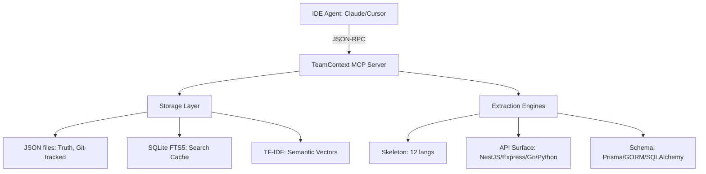

# 🧠 TeamContext: The Master Developer Guide
> **The Technical Memory That Outlives Everyone.**

TeamContext is a high-performance, Go-based MCP server designed to capture, index, and serve everything your team knows about your codebase. It doesn't just store files; it mines Git history, tracks architectural decisions, maps dependency flows, and provides token-efficient code analysis.

---

## 🚀 The "Magic" of `teamcontext init`

Running `teamcontext init` in a directory isn't just a setup command—it's an automated knowledge extraction event.

```bash
teamcontext init
```

**What happens in those few seconds:**
1.  **Skeleton Parsing**: Scans every file to extract its "skeleton" (function/class signatures) across 12+ languages.
2.  **Import Mapping**: Builds a full dependency graph of your project.
3.  **Git Archaeology**: Mines the entire history to identify who owns which files (Experts) and where knowledge is concentrated (Risks).
4.  **Semantic Indexing**: Builds a local TF-IDF vector index for natural language search—**no LLM required.**
5.  **IDE Plumbing**: Auto-configures Cursor, VS Code, and Windsurf to talk to the server.

---

## 🛠 Elite Developer Workflow

To get the most out of TeamContext, follow the "Triple-A" workflow: **Automate, Analyze, Augment.**

### 1. Automate Capture (Zero Friction)
Don't rely on humans to remember to document things.

*   **Git Hooks**: Install the post-commit hook. Every commit is analyzed for reverts, large deletions, and "Decision:" keywords in messages.
    ```bash
    teamcontext install-hooks
    ```
*   **Conversation Checkpoints**: The MCP server automatically saves your session summaries every 25 tool calls. You don't even have to ask.

### 2. Analyze with Token Efficiency
Stop pasting 500-line files into your AI. Use TeamContext's high-gain extraction tools to save **60-95% in tokens.**

| Tool | Focus | Payload |
| :--- | :--- | :--- |
| `get_skeleton` | Structure | Classes, Methods, Params, Returns. No bodies. |
| `get_types` | Definitions | Interfaces, Enums, Type aliases. |
| `get_blueprint` | Tasks | **Elite Tool.** Returns code patterns, imports, and checklists for a specific task. |
| `trace_flow` | Logic | Follows a data path across multiple files using the import graph. |

### 3. Augment Team Intelligence
TeamContext is a force multiplier for remote and growing teams.

*   **`teamcontext sync`**: Knowledge is stored in `.teamcontext/` as JSON. Syncing is just Git. No external database, no API keys, no security audits.
*   **`teamcontext feed`**: Like a Slack feed, but only for meaningful architectural changes and decisions.

---

## 📐 High-Impact Analysis Tools

### `get_blueprint` — The 20-in-1 Tool
When you start a task (e.g., "Add a new endpoint"), don't ask 20 questions. Call `get_blueprint`.
It returns:
- Relevant file patterns for your framework (NestJS, Gin, FastAPI, etc.)
- Required imports and types.
- Coding conventions and architectural decisions stored in TeamContext.
- A technical checklist to ensure you don't miss anything.

### Git Intelligence: The "Expert" Finder
Ever wonder who to ping in Slack? 
- `find_experts`: Ranks developers by ownership % and activity status.
- `get_knowledge_risks`: Identifies "Bus Factor" risks where key experts have left or are inactive.

---

## 📚 Deep Dives & Reference

While this guide covers the "Master" workflow, you can find exhaustive details in our dedicated reference docs:

*   **[Full Tool Reference](REFERENCE.md)**: Every MCP tool (54 total) with input schemas and examples.
*   **[Scenario Tutorials](TUTORIALS.md)**: Real-world walkthroughs for onboarding, bug fixing, and refactoring.
*   **[Demo Script](DEMO_SCRIPT.md)**: A 20-minute presentation guide for teams.

---

## ⚙️ Project Architecture



---

## 🛠 For Developers: Building & Extending

If you are developing **on** TeamContext itself, here is the technical landscape.

### Build System
The project uses a standard Go toolchain with a `Makefile` for convenience.

```bash
make build          # Local build (binary: ./teamcontext)
make test           # Run suite (unit + integration)
make lint           # Vet + Staticcheck
make install-system # Build and install to /usr/local/bin
```

### Core Architecture
- **`internal/mcp`**: The JSON-RPC server layer. This is where tools are registered and handled.
- **`internal/storage`**: Dual-layer storage. JSON (Source of Truth) + SQLite (FTS5/TF-IDF caching).
- **`internal/extractor`**: Static analysis for "High Impact" data like APIs and DB Models.
- **`internal/skeleton`**: The cross-language parser that computes code structure without intent (token-efficient).
- **`internal/search`**: Ripgrep integration for code search and the custom TFIDF engine for semantic search.
- **`internal/worker`**: Background goroutines for Git watching and incremental reindexing.

### Extending TeamContext

#### 1. Adding a New Tool
- Define the handler in `internal/mcp/server.go`.
- Register it in the `registerTools()` function.
- Add input schema documentation in `handleToolsList`.

#### 2. Supporting a New Language
- Update `internal/skeleton/parser.go` with regex patterns for the new language's classes and functions.
- Add file extension mapping in `detectLanguageFromPath`.

#### 3. Adding a New Framework (for Blueprints/API Surface)
- Update `internal/extractor/api.go` with the framework's routing patterns.
- Add framework detection logic (lookup in `package.json`, `go.mod`, etc.).

---

## 🎯 Cheat Sheet

| Intent | MCP Tool |
| :--- | :--- |
| "What is this project?" | `get_project` |
| "I just joined, help me." | `onboard` |
| "What changed recently?" | `get_feed` |
| "Why does this line exist?" | `get_commit_context` |
| "Am I following the rules?" | `check_compliance` |
| "Where did we leave off?" | `resume_context` |

---

*"The brain that remembers everything. The brain that outlives everyone."*
